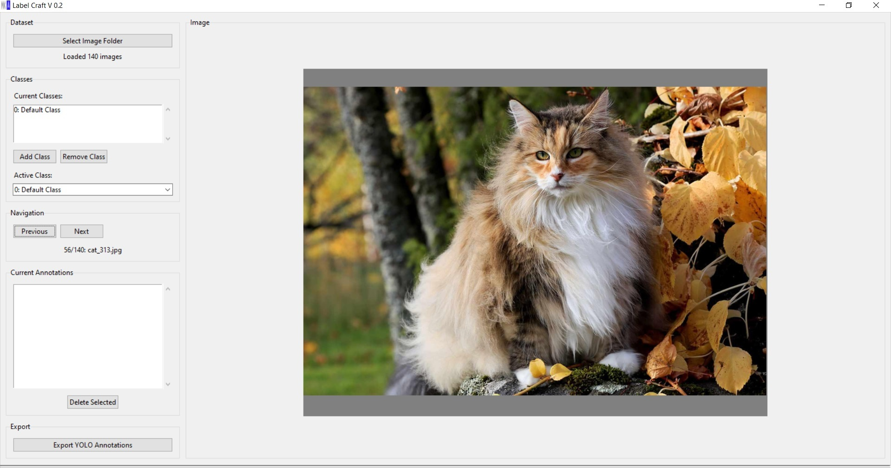
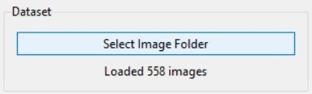
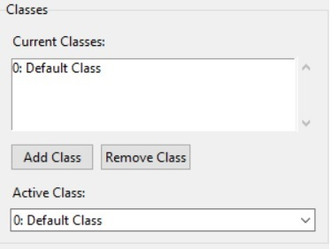
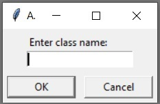
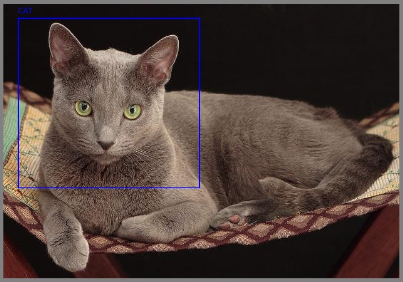
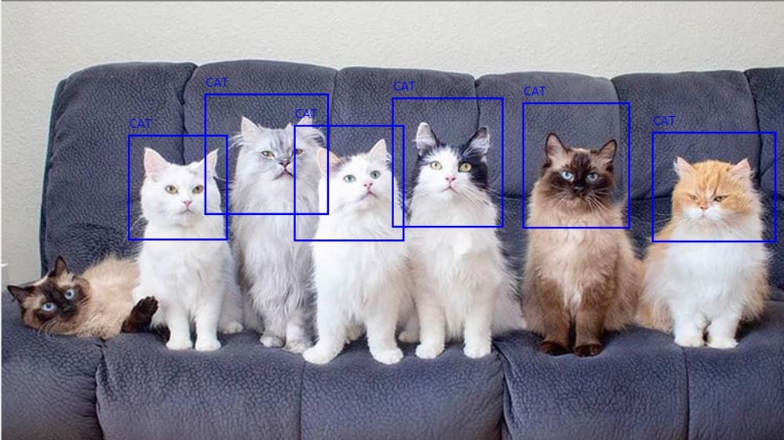
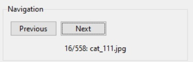
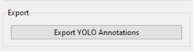

# LabelCraft

A simple yet powerful **Tkinter-based GUI tool** to create, edit, and export **bounding box annotations** in **YOLO format** for image datasets.  
Ideal for training YOLO-based object detection models.

---
## Application GUI



## How to Start With this application

### Step 1: 
- option 1 : Download the repo
- Option 2 : Clone git repo 
    ```bash
        git clone <>
    ```
    - Make Sure python **Python ≥ 3.8**
### Step 2:
- Install the necessary library 
    ```bash
        pip install requirments.txt
    ```
- **Recommneded :** Create Virtual environment and install all the necessary libaries inside the virutal environment.

### Step 3:
- Run the application 
    ```bash
        python main.py
    ```

## How to Use

- **Load image folder** and automatically detect all supported formats (`.jpg`, `.jpg`, `.bmp`, `.tiff`, etc.)

    
-  **Add, remove, or rename object classes** dynamically.
    - Active Class will be the class for bounding box drawing.
    -  Keyboard Shortcuts
        - Key	Action
        - Left Arrow	Previous Image
        - Right Arrow	Next Image
        - 0-9	Switch active class by index

     

    
-  **Draw bounding boxes** directly on images using your mouse. You can annotate single as well as multi class.

    
    

-  **Navigate between images** easily with “Next” and “Previous” buttons or arrow keys.
    
-  **Auto-save and export annotations** in standard YOLO format:
class_id x_center y_center width height
    
    - All annotation will be same with in folder as image_name.txt
    -  **Built-in support for existing annotations** – loads `.txt` files if present.
-  **Displays annotations** with distinct colors per class.
-  **Exports `classes.txt`** file automatically for YOLO training.


## Note : All the annotation file will be stored in annotation image folder.
 
---

### Ultralytic YOLO format 

```bash
## If you have single annotation in one image
<class_id> <x_center> <y_center> <width> <height>
```
```bash
## If you have multiple annotation in one image
<class_id> <x_center> <y_center> <width> <height>
<class_id> <x_center> <y_center> <width> <height>
<class_id> <x_center> <y_center> <width> <height>
<class_id> <x_center> <y_center> <width> <height>
```
## Author Information
- **Name     :** Kuldeep Singh
- **Email    :** shergillkuldeep@outlook.com
- **Linkedin :** 
- **GitHub   :** https://github.com/abyshergill

## License
This project is released under the **GPL License**

## Future Plan
In future i will add more annotation format and different folder selection option during export.

## ⭐ Acknowledgments
Inspired by popular labeling tools like **LabelImg** and **Roboflow Annotator**, but designed to be lightweight, offline, and open-source.